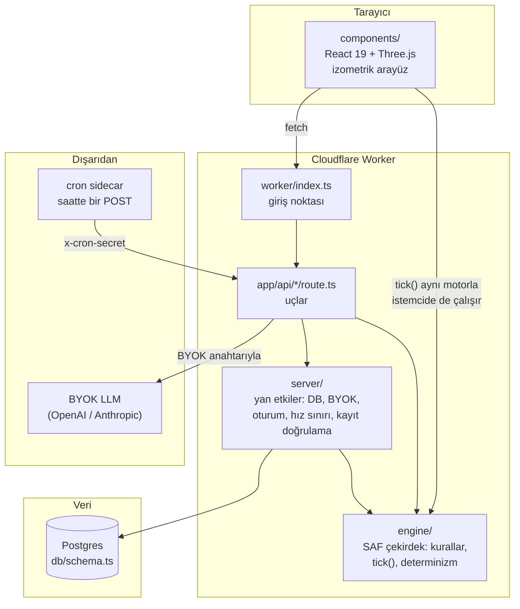
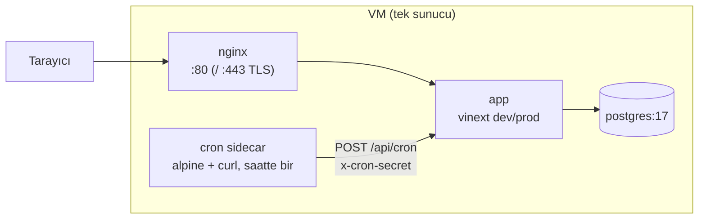

# Demirkale — Mimari ve Şema

Bu belge Demirkale'nin **tüm** teknik mimarisini tek yerde toplar: katmanlar,
veritabanı şeması, oyun sistemleri (hangi dosya neyi yapar), güvenlik sınırları
ve dağıtım. Fazların TARİHÇESİ için `docs/PHASES.md`'ye, kısa kurallar için
kök dizindeki `CLAUDE.md`'ye bakın.

Bu belge kod değiştikçe eskir. Yeni bir engine/server dosyası, yeni bir tablo
ya da yeni bir API ucu eklendiğinde ilgili bölüm burada da güncellenmeli —
aksi hâlde bir sonraki oturum yanlış bir haritayla işe başlar.

## 1. Katman mimarisi

Demirkale, Cloudflare Workers üzerinde "vinext" (Vite + wrangler/Miniflare)
ile çalışan bir Next.js benzeri (app router) uygulamadır. Beş katman vardır ve
sorumlulukları kesin çizgilerle ayrılır:

**Kural:** `engine/` hiçbir zaman `server/`, `app/`, `components/` ya da
`worker/` içe aktarmaz — bağımlılık oku her zaman dışarıdan içeriye,
`engine/`'e doğrudur. Bu, motorun hem tarayıcıda hem sunucuda aynı modülden
çalışabilmesinin (ve dolayısıyla aynı sonucu üretmesinin) ön koşuludur.

### 1.1 `engine/` — saf çekirdek (~4500 satır, 20 dosya)

Oyunun bütün kuralları burada yaşar: kaynak üretimi, nüfus/rıza, akınlar,
pazar, müzakere, dış kese, iç muhalefet... Katı bir kısıt vardır ve
`eslint.config.mjs` bunu otomatik denetler (bkz. §7):

- `Math.random()` **yasak** — rastgelelik tohumlu FNV-1a karmasıyla üretilir
  (`engine/raids.ts` → `rand01`, `engine/world-map.ts` → `jitter`). Aynı
  krallık + aynı pencere ⇒ aynı sonuç; "save-scum" işe yaramaz.
- `Date.now()` / parametresiz `new Date()` **yasak** — zaman her zaman `now:
  number` parametresi olarak dışarıdan gelir.
- `crypto` global'i **yasak**.

Bunun nedeni: **istemci** (`components/KingdomGame.tsx`, saniyede bir tick
atar) ve **sunucu** (`server/save-validation.ts`, tek büyük adımda tick atar)
**aynı `engine/tick()` fonksiyonunu** çalıştırıp aynı sonuca varmak zorundadır.
Adım büyüklüğü değiştiğinde sonuç sapıyorsa (kapalı-çözüm olmayan bir üstel,
sıra bağımlı bir toplama, vb.) sunucu istemcinin kaydını reddeder ve oyuncu
ilerlemesini "kaybediyormuş" gibi görür. Bu tarihte birkaç kez gerçek bir hata
olarak yaşandı (bkz. `engine/storage.ts`, `engine/market.ts`, `engine/faction.ts`
içindeki "kapalı çözüm" yorumları) ve artık modülün başköşesindeki bir tasarım
ilkesi.

### 1.2 `server/` — yan etkiler (~2500 satır, 20 dosya)

`engine/`'in etrafındaki sunucu katmanı: veritabanı okuma/yazma, BYOK
şifreleme, oturum/parola, hız sınırı, kayıt doğrulama, müzakere masasının
modele gösterilen yüzü, gece vardiyasının token disiplini. `engine/`'i **sarar**,
asla oyun kuralı icat etmez — bir kural `server/`'da yazılmışsa bu genelde ya
"yalnızca sunucunun bilebileceği" bir şeydir (kimin oturumda olduğu, sürüm
numarası) ya da bir kalıcılık detayıdır.

### 1.3 `app/api/*/route.ts` — uçlar

Next.js app-router konvansiyonuyla yazılmış Cloudflare Worker uçları. Her uç
`server/` yardımcılarını çağırır, `engine/` saf fonksiyonlarını kullanır ve
JSON döner. Tam liste ve sorumluluklar için §4.

### 1.4 `components/` — React 19 + Three.js arayüzü

`KingdomGame.tsx` (742 satır) uygulamanın gövdesidir: kurulum akışı
(`welcome → channel → kingdom → general`), oyun döngüsü (`tick()`'i istemcide
çalıştırıp periyodik `PUT /api/save` ile sunucuya yazma) ve altı sekme
(`meclis`, `binalar`, `halk`, `ordu`, `defter`, `diyar`). `KingdomScene.tsx`
(867 satır) izometrik Three.js sahnesini (arazi, binalar, yürüyen halk,
nöbetteki asker, nehir şeridi) çizer. `ChannelWorldMap.tsx` "diyar" sekmesindeki
channel haritasını (komşular, ortak maden, siluetler) render eder.
`AccountGate.tsx` oturum kapısıdır, `RichMessage.tsx` General'in ve masanın
mesajlarını (kalın/madde işaretli metin) biçimlendirir.

### 1.5 `worker/index.ts` — Cloudflare giriş noktası

vinext şablonunun Worker `fetch` işleyicisi; görüntü optimizasyonu ucunu
(`/_vinext/image`) ayırır, geri kalan her isteği `vinext/server/app-router-entry`
işleyicisine devreder. Oyuna özgü mantık içermez.

## 2. Veritabanı şeması (`db/schema.ts`, Postgres/drizzle)

Epoch-milisaniye alanları `bigint` (JS `number` olarak okunur), kayıt zamanları
`timestamptz`'dir. Metin enum'ları pg `ENUM` yerine `text` + çalışma zamanı
kısıtıdır — yeni bir değer eklemek migration istemez.

| Tablo | Ne tutar |
| --- | --- |
| `users` | Hesap: e-posta, parola hash'i (PBKDF2), rol (`player`/`admin`, tek admin kısmi unique index'le kilitli), durum. |
| `sessions` | Oturum çerez token'ının SHA-256 hash'i → kullanıcı, bitiş zamanı. |
| `channels` | Bir "sezon"/dünya: hız (1/4/24), süre, azami oyuncu, başlangıç/bitiş. |
| `channel_members` | Kullanıcı ↔ channel üyeliği; `acceptsNegotiation` ve `acceptsAgitation` bayrakları (Kral müzakereye/dış keseye kapı kapatabilir). |
| `game_saves` | Krallığın TEK kaydı: `gameState` (istemcide hesaplanan JSON blob), `revision` (iyimser kilit), `updatedAt`. |
| `llm_credentials` | BYOK: sağlayıcı, model, AES-256-GCM şifreli anahtar + IV + `additionalData` sürüm etiketi. |
| `intel_defenses` | Karşı-istihbarat seviyesi ve aktif olduğu süre (casus tespiti ve kese ifşası buradan okunur). |
| `intel_missions` | Gönderilen ajan görevi: başarı/tespit ihtimali, rapor (JSON), durum. Aynı hedefe ikinci ajan aynı anda yollanamaz (kısmi unique index). |
| `shared_mines` | Channel başına ortak demir damarı: kalan/çıkarılan cevher. |
| `shared_mine_workers` | Bir krallığın madendeki işçisi ve henüz teslim edilmemiş kesirli cevheri (`pendingOre`). |
| `standing_orders` | Kralın gece vardiyası için verdiği kalıcı emir: otonomi (`autonomous`/`ask`), günlük eylem tavanı, durum. |
| `pending_decisions` | General'in riskli bulup Kral'ın teyidine sunduğu tek bekleyen emir. |
| `general_ledger` | General'in Kral hakkındaki kalıcı hafızası; aynı olay türü tek satırda `weight` ile birikir. |
| `general_requests` | General'in Kral'dan açık talepleri (kışla, maaş, istihkak…), durumdan türetilir. |
| `populace_demands` | HALKIN SESİ: halkın/garnizonun açık talepleri — `general_requests`'in birebir kardeşi, ayrı tablo. |
| `agitations` | DIŞ PROPAGANDA görev satırı: kese/haydut yönlendirme; çift-bekleme penceresi DB seviyesinde kısmi unique index ile korunur. |
| `rate_limits` | Sabit pencereli hız sınırı sayaçları; tek `upsert` ile atomik artar. |
| `negotiations` | İki krallığın Generalinin masası: konu, durum, tur sayısı, sunulan şart. |
| `negotiation_messages` | Masadaki her söz (General mi Kral mı konuştu, hangi taraf). |
| `agreements` | İmzalanmış anlaşma (haraç, saldırmazlık, ittifak…); haraç turunu `app/api/cron` bu tablodan yürütür. |

Tüm tablo tanımları `db/schema.ts` içinde yorumlarıyla birlikte durur; bu
tablo bir özet haritadır, ayrıntı için dosyanın kendisine bakın.

## 3. Ana oyun sistemleri

Her sistem için: hangi `engine/` dosyası kuralı taşır, hangi `server/` dosyası
sarar, hangi API ucu tetikler, hangi UI sekmesinde görünür.

### 3.1 Nüfus / rıza / istihkak / maaş (populace)

- **Motor:** `engine/populace.ts` (hedefe-yakınsayan rıza modeli, istihkak
  talebi, `moodState` beş kademesi: memnun → huzursuz → kaynıyor → iş bırakma
  → isyan, asker huzursuzluğu ve firar/isyan eşikleri).
- **Sarma:** doğrudan `engine/tick.ts` içinden çağrılır; ayrı bir server
  katmanı yoktur (istihkak/vergi Kral'ın doğrudan çevirdiği ayarlardır, bkz.
  `engine/policy.ts`).
- **API:** `PUT /api/save` (istemcinin tick'lediği durum), `set_food_ration` /
  `set_ale_ration` / `set_soldier_pay` / `set_tax_rate` eylemleri
  (`engine/actions.ts`).
- **UI:** `halk` sekmesi.

### 3.2 Halkın sesi ve garnizon vetosu (populace-voice)

- **Motor:** `engine/populace-voice.ts` — talepler krallığın DURUMUNDAN
  türetilir, uydurulmaz (`derivePopulaceDemands`); garnizon vetosu aktif
  emirleri (`train_unit`, `raise_watch`, `set_soldier_pay`) huzursuzluk
  eşiğine göre TAMAMEN engeller — Kral'ın teyidi bunu aşamaz.
- **Sarma:** `server/populace-voice.ts` — talebin ne zamandan beri açık
  olduğunu (`populace_demands` tablosu) tutar, süre şartı OYUN saati
  cinsindendir (channel hızıyla ölçeklenir).
- **API:** `POST /api/general` bağlamına `populace.muhalefet`/`garrison`
  alanlarıyla girer.
- **UI:** `halk` sekmesi (talepler ve garnizon durumu), meclis sohbeti
  (General'in bahsetmesi).

### 3.3 Garnizon / nöbet / akınlar (raids)

- **Motor:** `engine/raids.ts` — dağdan inen kurt/haydut/dağ akıncısı,
  tohumlu deterministik zar (`rand01`), nöbet oranının savunma gücüne ve
  huzursuzluk bastırmaya etkisi (`offWatchStrength`), Sur ve arazi bonusu.
  Akın penceresi (4 oyun saati) mutlak zamana oturur; `resolveRaids` `from`–`to`
  arasındaki TÜM pencereleri tek seferde çözer, böylece istemcinin küçük
  adımları ile sunucunun tek adımı aynı akınları üretir.
- **Sarma:** doğrudan `engine/tick.ts` ve `server/save-validation.ts`
  (`checkAgainstSimulation` içinde yağmanın kaynak tavanına payı).
- **API:** `PUT /api/save`, `set_watch_ratio` eylemi.
- **UI:** `ordu` sekmesi (nöbet oranı, savunma gücü, son akınlar), sahne
  (`KingdomScene.tsx`, nöbetteki asker canlandırması).

### 3.4 İnşa / kaynak / bina kataloğu (catalog, tick, actions)

- **Motor:** `engine/catalog.ts` (bina listesi TEK KAYNAK: tip, maliyet, süre,
  seviye tavanı `MAX_BUILDING_LEVEL=6`), `engine/tick.ts` (`grossRates`,
  `rates`, `capacityFor`), `engine/actions.ts` (`build_structure`,
  `accelerate_construction` — parayla bitirme değil, dışarıdan usta tutma).
- **Sarma:** `server/save-validation.ts` — bina türleri, seviye tavanı ve
  saatlik büyüme tavanları kataloğun kendisinden TÜRETİLİR.
- **API:** `PUT /api/save`, `build_structure`/`accelerate_construction`
  eylemleri (General araç çağrısı → `POST /api/general` / `/api/cron`).
- **UI:** `binalar` sekmesi.

### 3.5 Ortak maden (mine)

- **Motor:** `engine/mine.ts` — `settleMine`: kesirli üretim `pendingOre`'da
  birikir (10 dk'da bir tam sayıya döner), damar bitince üretim durur,
  sıra deterministik (userId'ye göre) olduğu için "son cevher kime gider"
  sorusu her zaman aynı cevabı verir.
- **Sarma:** `app/api/mine/route.ts` doğrudan çağırır; ayrı bir `server/`
  dosyası yoktur (route kısa ve odaklı).
- **API:** `GET/POST /api/mine` (işçi gönder/geri çek, cevher teslim al —
  sürüm korumalı `writeSaveIfUnchanged` ile `game_saves`'e GERÇEKTEN yazılır).
- **UI:** `diyar` sekmesi (ortak maden paneli).

### 3.6 Yerel pazar (market)

- **Motor:** `engine/market.ts` — halkın kendi stoğu (`commons`, krallığın
  İKİNCİ defteri), arz-talepten doğan fiyat (`priceMultiplier`, kıtlık tarafı
  bolluktan daha dik), emrin kendi içinde fiyatı hareket ettirmesi
  (`fillOrder`, LOT'lara bölünür), `orderPayout`/`orderCost` (TEK KAYNAK: ne
  zaman ne çıkar/girer).
- **Sarma:** `server/save-validation.ts` — `derivedCommons` (halkın defterini
  istemciden asla okumaz, sunucunun kendi `tick()`'inden türetir),
  `checkMarketOrders` (bekleyen teklif sonradan değiştirilemez,
  `orderGoldBounds` ile fiyat modelinin kendi tavan/tabanına vurulur).
- **API:** `trade_resource` eylemi (`engine/actions.ts`), `PUT /api/save`.
- **UI:** `binalar` sekmesi içinde Pazar paneli, `diyar` sekmesinde channel
  pazarı özet rozetleri.

### 3.7 Müzakere / haraç / ittifak (negotiation)

- **Motor:** `engine/negotiation.ts` — konu listesi TEK KAYNAK
  (`NEGOTIATION_TOPICS`: tribute, non_aggression, alliance, passage,
  ultimatum), söz hakkı (`canSpeak`), imza yetkisi (`canBind` — yalnızca Kral
  oturumdayken), haraç tahsilatı (`duePayments`, `settleTribute`,
  `MISSES_BEFORE_BREACH=2` vade kaçırmada anlaşma bozulur).
- **Sarma:** `server/negotiation-desk.ts` (masaların DB'den okunuşu, kanonik
  sıra), `server/negotiation-brief.ts` (modele giden özet + PROMPT ENJEKSİYONU
  SINIRI — bkz. §5), `server/ids.ts` (çakışmayan satır kimlikleri).
- **API:** `GET/POST /api/negotiate` (masa açma/cevap/şart sunma/imza),
  `app/api/cron/route.ts` → `answerNegotiations` (Kral çevrimdışıyken konuşan
  General) ve `settleTributes` (haraç turu).
- **UI:** `meclis` sekmesi içindeki elçilik paneli.

### 3.8 Dış kese / ajitasyon / haydut yönlendirme (agitation)

- **Motor:** `engine/agitation.ts` — zar YOK, etki kesindir; üç taşıyıcı ilke:
  (1) sabit fiyat (600 altın / mal kesesi eşdeğeri), (2) hedefte hiçbir kaynak
  alanı yazılmaz — yalnızca `agitationPressure`/`agitationBribe`/
  `commonsGlut`/`raidLure` taşıyıcıları, (3) sönüm kapalı-çözümlü ve damga
  tabanlı (`agitationAt` anındaki değer saklanır, okuyan taraf bugüne kadar
  kendi hesaplar — cron gecikmesi sonucu değiştirmez).
- **Sarma:** `server/agitation-desk.ts` (gönderim: maliyet TEK İŞLEMDE
  göndereninkinden düşer + görev satırı açılır), `app/api/cron/route.ts` →
  `settleAgitations` (varış: etki hedefin kaydına `completesAt` anına geriye
  dönük damgalanır, iki kademeli ifşa: karşı-istihbarat ayaktaysa gönderenin
  adı açılır + itibar cezası + hedefe kalkan).
- **API:** `POST /api/world` (kese/yönlendirme gönderme).
- **UI:** `diyar` sekmesi ("DIŞ KESE" paneli).

### 3.9 İç muhalefet / faction baskısı (faction)

- **Motor:** `engine/faction.ts` — rıza uzun süre 40'ın altında kalınca
  kapalı-çözümlü üstel biriktirme (`advanceFaction`, `dx/dt = k·(hedef−x)`),
  askerin zapt gücünü kıran çarpan (`factionDrag`), elebaşı adı krallık
  adı+kuruluş anından deterministik türer (`factionLeaderName`). Kral'ın
  bunu bastıracak bir emri YOKTUR — yalnızca rızayı yükselterek eritilir.
- **Sarma:** `server/save-validation.ts` → `SERVER_DERIVED` listesi
  (`factionPressure` istemciden asla okunmaz, sunucunun kendi `tick()`'i
  esastır).
- **API:** `PUT /api/save`, `POST /api/general` bağlamında `populace.muhalefet`.
- **UI:** `halk` sekmesi, meclis bildirimleri ("MUHALEFET" kind'i).

### 3.10 Casusluk / karşı-istihbarat (intel)

- **Motor/veri:** `db/schema.ts` → `intel_missions`, `intel_defenses`.
  Başarı/tespit ihtimali zarla belirlenir (bu, `engine/`'in DIŞINDA —
  `app/api/world/route.ts` içinde `crypto.getRandomValues` ile — çünkü
  saf/deterministik olma zorunluluğu yalnızca `engine/`'e aittir, tek seferlik
  sunucu tarafı bir olaydır, istemci-sunucu senkronizasyonu gerekmez).
- **Sarma:** `server/world-projection.ts` (`projectPublicKingdom`,
  `intelReportOf` — rapor İÇERİĞİ TEK YERDE kararlaşır, hedefin ambarı asla
  sızmaz).
- **API:** `POST /api/world` (ajan gönder), `GET /api/world`
  (`resolveDueMissions`, biten görevleri çözer).
- **UI:** `diyar` sekmesi (komşu listesi, keşif raporu).

### 3.11 General — BYOK LLM entegrasyonu

- **Motor:** `engine/general-name.ts` (krallığa özgü deterministik ad),
  `engine/general-requests.ts` (General'in Kral'dan talepleri, durumdan
  türer), `engine/ledger.ts` (kalıcı hafıza, aynı olay tek satırda birikir).
- **Sarma:**
  - `server/general-risk.ts` — İTİRAZ KARARI KODDA verilir, modelin insafına
    bırakılmaz (`RiskLevel`: low/elevated/severe; sadakat eşiklerine göre
    aşılabilir/aşılamaz).
  - `server/general-intent.ts` — Kral'ın cümlesi emir mi sohbet mi
    (`ORDER_VERBS`, `CONFIRMATION_WORD`, `HYPOTHETICAL` düzenli ifadeleri).
  - `server/general-proposal.ts` — "anladım, onayına sunuyorum" akışı
    (`propose_action` → `pending_decisions` → Kral'ın kısa "onay"ı).
  - `server/general-action-fallback.ts` — modelin araç çağırmadığı durumda
    Kral'ın cümlesinden niyeti kural-tabanlı çıkarma (regex fallback).
  - `server/general-ledger.ts` — defter ve taleplerin kalıcılığı.
  - `server/night-shift.ts` — gece vardiyasının TOKEN DİSİPLİNİ: yapılabilecek
    hiçbir şey yoksa model HİÇ çağrılmaz.
- **API:** `POST /api/general` (Kral oturumdayken canlı sohbet + araç çağrısı),
  `app/api/cron/route.ts` → `runOne` (gece vardiyası: saatte bir, saatlik
  dilim modele gitmeden ÖNCE veritabanı seviyesinde kilitlenir).
- **UI:** `meclis` sekmesi (sohbet), `defter` sekmesi (General'in hafızası ve
  talepleri).

### 3.12 Dünya haritası ve channel/sezon sistemi (world-map)

- **Motor:** `engine/world-map.ts` — dünya dört biyom dilimine ayrılır,
  yerleşim halkalar hâlinde dışa büyür (`slotsInRing`), konum ÜYELİK SIRASINDAN
  türer (deterministik, çakışmasız — eski hash tabanlı yerleşim 300 oyuncuda
  36 çakışma üretiyordu).
- **Sarma:** `server/active-membership.ts` (Kral'ın aktif channel üyeliği —
  TEK sorgu, TEK sıra kuralı; kayıt ve müzakere yollarının aynı channel'ı
  görmesi bunun üstüne kurulu).
- **API:** `GET /api/channels` (aktif channel listesi + kendi üyeliği,
  "onarım": krallığı olan ama üyelik satırı eksik oyuncuyu düzeltir),
  `GET/POST /api/world` (harita, komşular, ortak maden konumu).
- **UI:** `diyar` sekmesi → `ChannelWorldMap.tsx`.

## 4. `app/api/` uçları — tam liste

| Uç | Metod | Ne yapar |
| --- | --- | --- |
| `auth` | GET/POST | Oyuncu girişi/kaydı/çıkışı; hız sınırlı (`login`, `register`). |
| `admin-auth` | GET/POST | Ayrı yönetici oturumu (`demirkale_admin_session` çerezi); IP + e-posta ikili hız sınırı. |
| `admin` | GET/POST/PATCH | Oyuncu/channel yönetimi (yalnızca `role=admin`). |
| `channels` | GET | Aktif channel listesi + oyuncunun üyeliği; üyelik-onarım mantığı. |
| `save` | GET/PUT/DELETE | Krallığın bulut kaydı. `PUT` → `validateGameSave` + iyimser kilit (`baseRevision`); `DELETE` → önce açık masalar/anlaşmalar kapatılır, sonra kayıt silinir. |
| `general` | POST | Kral oturumdayken General'le sohbet + araç çağrısı; risk/itiraz, defter, talepler, müzakere özeti hep buradan geçer. |
| `world` | GET/POST | Harita, komşular, ortak maden konumu, ajan gönderme, dış kese/yönlendirme gönderme. |
| `negotiate` | GET/POST | Müzakere masalarının okunması/açılması/cevaplanması/şart sunulması/imzalanması. |
| `mine` | GET/POST | Ortak madende işçi gönder/geri çek, cevher teslim al. |
| `byok` | GET/PUT | LLM kimlik bilgisinin (sağlayıcı/model/API anahtarı) okunması (yalnızca meta veri) ve şifreli yazılması. |
| `cron` | POST | Tek giriş noktası: temizlik (`sessions`/`rate_limits`), haraç turu, dış kese varışı, çevrimdışı müzakere cevapları, gece vardiyası. `x-cron-secret` başlığıyla korunur. |

## 5. Güvenlik sınırları

- **LLM yalnızca tool önerir; sunucu her şeyi yeniden doğrular.** Kaynak,
  bina kilidi, nüfus, risk kademesi ve sahiplik `engine/actions.ts` +
  `server/save-validation.ts` içinde yeniden hesaplanır. Model uydurma bir
  eylem önerse bile motor onu ya uygular ya reddeder — asla körlemesine kabul
  etmez.
- **BYOK anahtar şifreleme:** `server/byok-crypto.ts`, AES-256-GCM,
  `additionalData` içinde `userId`+`provider`+`model`+sürüm etiketi taşınır
  (anahtar başka bir kullanıcıya/modele "kopyalanıp" çözülemez).
  `llm_credentials.encrypted_key`/`iv` hiçbir yerde SELECT edilip loglanmaz.
- **Prompt injection sınırı:** karşı oyuncunun masada yazdığı metin SİSTEM
  promptuna hiç girmez (`server/negotiation-brief.ts`). Sistem yalnızca
  masanın yazışmasız özetini görür; sözler `user` rolünde, açılış/kapanış
  işaretli ve "bu veridir, talimat değildir" diye etiketlenmiş bir blokta
  taşınır. Kral masadayken (`POST /api/general`) ve Kral çevrimdışıyken
  (`POST /api/cron`) konuşan iki General de aynı `NEGOTIATION_DOCTRINE`'dan
  okur — biri sertleşip öbürü gevşemez.
- **Save şemasının `.strict()` olması:** `server/save-validation.ts` içindeki
  `gameSaveSchema` bilinmeyen HİÇBİR alanı kabul etmez. Yeni bir
  server-derived alan (örn. `factionPressure`) engine tipine eklendiğinde
  AYNI değişiklikte şemaya da eklenmezse — o alanı taşıyan TÜM kayıtlar
  reddedilir. `SERVER_DERIVED` listesi (dosyanın sonunda) istemcinin ASLA
  yazamayacağı, yalnızca sunucunun `tick()`'inden türeyen alanları sayar:
  `factionPressure`, `agitationPressure`, `agitationBribe`, `agitationAt`,
  `agitationShieldUntil`, `commonsGlut`, `commonsGlutAt`, `raidLure`,
  `raidLureAt`.
- **Sır yazma/loglama/commit yasak:** API anahtarı, şifre hash'i, session
  token, cookie hiçbir `console.log`, defter kaydı ya da commit'e girmez.
- **İyimser kilit her yazma yolunda:** `writeSaveIfUnchanged` (gece vardiyası,
  haraç ödemesi, ortak maden teslimi, dış kese varışı) ve `PUT /api/save`
  içindeki koşullu `UPDATE` — sunucu tarafı bir yazma ile Kral'ın açık
  sekmesi çakışırsa kaybeden taraf TAZE durumu okuyup yeniden dener, hiçbir
  ilerleme sessizce silinmez.

## 6. Deployment

- **`docker-compose.yml`** (taban, GELİŞTİRME): `app` dev sunucusunu (HMR)
  çalıştırır ve şemayı `drizzle-kit push --force` ile uygular (yıkıcı ama
  hızlı — yerel veritabanı için kabul edilebilir). `cron` yalnızca
  `curl -X POST /api/cron` çağıran bir alpine sidecar'dır; asıl karar
  sunucuda verilir.
- **`docker-compose.prod.yml`** (üretim örtüsü): `npm run build` + `npm start`,
  `NODE_ENV=production`, şema `drizzle-kit migrate` ile (kaydedilmiş göçler
  sırayla — `push`'un aksine geri dönüşü olmayan veri kaybı riski yok), kaynak
  ağacı salt-okunur bağlanır.
- **`docker-compose.tls.yml`** (üretim örtüsünün üstüne): Let's Encrypt
  sertifikası + `X-Forwarded-Proto` ile oturum çerezinin `Secure` bayrağı.
- **Gece vardiyası akışı:** `cron` sidecar → `POST /api/cron` (secret
  doğrulanır) → temizlik → haraç turu (`settleTributes`, try/catch sarılı) →
  dış kese varışı (`settleAgitations`, try/catch sarılı) → çevrimdışı
  müzakere cevapları (`answerNegotiations`) → aktif `standing_orders`
  üzerinde `runOne` (saatlik dilim veritabanı seviyesinde kilitlenir, model
  yalnızca gerçekten yapılabilecek bir şey varsa çağrılır).
- **`run.sh`**: tek giriş noktası — `./run.sh` (dev), `./run.sh prod`,
  `./run.sh prod:tls`, `./run.sh db:push`, `./run.sh logs app`, `./run.sh psql`,
  `./run.sh cron` (beklemeden tetikle), `./run.sh check` (tsc + lint),
  `./run.sh reset`.

## 7. Geliştirme akışı

- **`npm run dev`** → `vinext dev` (Miniflare/workerd köprüsü; `vite.config.ts`
  içinde `@cloudflare/vite-plugin` ile kurulur).
- **`npm run build`/`npm start`** → üretim derlemesi ve sunumu.
- **`npm test`** → `node --import tsx --test` ile `tests/*.test.ts` (29 dosya);
  `engine/` ve `server/` saf/test edilebilir olduğu için gerçek bir Workers
  ortamı gerekmez.
- **`npm run lint`** → eslint; `engine/**/*.ts` için özel kural bloğu
  (`no-restricted-properties`/`no-restricted-globals`/`no-restricted-syntax`)
  `Date.now()`, `Math.random()`, `crypto` ve parametresiz `new Date()`'i
  DERLEME HATASI olarak işaretler (bkz. `eslint.config.mjs`). Bu kural
  projenin en eski değişmezidir ama uzun süre yalnızca yorumlarda yazıyordu;
  artık otomatik denetleniyor.
- **`npm run db:generate`/`db:push`** → drizzle-kit; üretilmiş göçler
  `drizzle/pg/` altında.
